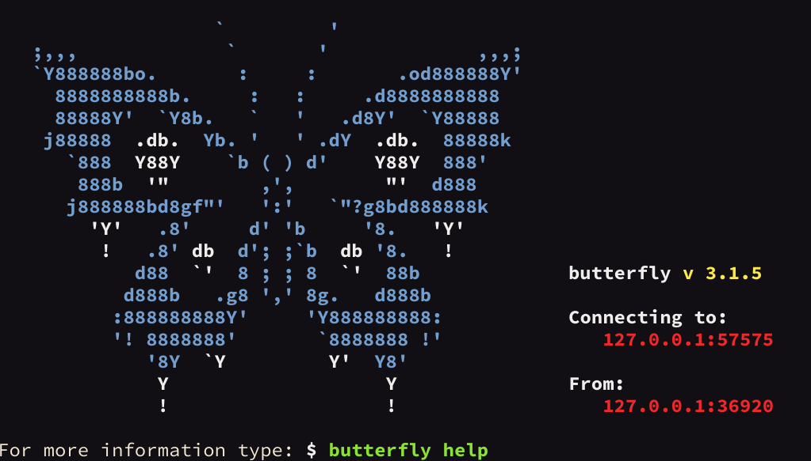

# butterfly-nginx



Install butterfly terminal emulator behind a Let's Encrypt cert secured nginx proxy.

To register with Let's Encrypt use nginx's default setup with the webroot plugin. Once that is done
use the server config detailed below, which also includes the webroot setup, to serve
butterfly.

# Prerequisites

* Ubuntu 16.04 or later server 
* You must own or control the registered domain name that you wish to use the
  certificate with. Make use of any of the many domain name registars. There must be a
  A Record that points your domain to the public IP address of your server.

Recipe follows, be sure to substitute ```docker.sthysel.net``` with the correct
domain name.

## Install nginx 

```bash
$ sudo apt-get install nginx
```

Edit /etc/nginx/sites-available/default to include the .well_known location for the 
webroot plugin that 'Lets Encrypt' will use to verify that you control the domain you
want the cert for.


```
server {
        listen 80 default_server;
        listen [::]:80 default_server;


        root /var/www/html;

        index index.html index.htm index.nginx-debian.html;

        server_name _;

        location / {
                # First attempt to serve request as file, then
                # as directory, then fall back to displaying a 404.
                try_files $uri $uri/ =404;
        }

       location ~ /.well-known {
                allow all;
        }
}
```

Test with ```$ sudo nginx -t``` and restart ```$ sudo systemctl restart nginx```

## Install certbot

```bash
$ sudo add-apt-repository ppa:certbot/certbot
$ sudo apt-get update
$ sudo apt-get install certbot
```

Mint the certificate.

```bash
$ sudo certbot certonly --webroot --webroot-path=/var/www/html -d docker.sthysel.net
```

They appear here:

```bash
INSERT  thys@dockerhost   ~  sudo tree /etc/letsencrypt/live  
[sudo] password for thys: 
/etc/letsencrypt/live
└── docker.sthysel.net
    ├── cert.pem -> ../../archive/docker.sthysel.net/cert1.pem
    ├── chain.pem -> ../../archive/docker.sthysel.net/chain1.pem
    ├── fullchain.pem -> ../../archive/docker.sthysel.net/fullchain1.pem
    ├── privkey.pem -> ../../archive/docker.sthysel.net/privkey1.pem
    └── README
``` 

The butterfly nginx config will use those certs.

### Generate Strong Diffie-Hellman Group 

To further increase security, you should also generate a strong Diffie-Hellman
group. To generate a 2048-bit group, use this command:

```bash
$ sudo openssl dhparam -out /etc/ssl/certs/dhparam.pem 2048 
```

This may take a few minutes but when it's done you will have a strong DH group at
```/etc/ssl/certs/dhparam.pem.```


## nginx snippets for encrypted connections

In ```/etc/nginx/snippets/ssl-params.conf```

```
# from https://cipherli.st/
# and https://raymii.org/s/tutorials/Strong_SSL_Security_On_nginx.html

ssl_protocols TLSv1 TLSv1.1 TLSv1.2;
ssl_prefer_server_ciphers on;
ssl_ciphers "EECDH+AESGCM:EDH+AESGCM:AES256+EECDH:AES256+EDH";

ssl_ecdh_curve secp384r1;
ssl_session_cache shared:SSL:10m;
ssl_session_tickets off;
ssl_stapling on;
ssl_stapling_verify on;
resolver 8.8.8.8 8.8.4.4 valid=300s;
resolver_timeout 5s;
# disable HSTS header for now
#add_header Strict-Transport-Security "max-age=63072000; includeSubDomains; preload";
add_header X-Frame-Options DENY;
add_header X-Content-Type-Options nosniff;

ssl_dhparam /etc/ssl/certs/dhparam.pem;

```


In ```/etc/nginx/snippets/ssl-docker.sthysel.net.conf```

```
ssl_certificate /etc/letsencrypt/live/docker.sthysel.net/fullchain.pem;
ssl_certificate_key /etc/letsencrypt/live/docker.sthysel.net/privkey.pem;
```


## Install butterly 

Install in nginx docroot, for this config its in ```/var/www/html```


``` bash
$ sudo bash
$ mkdir -p /var/www/butterfly
$ cd /var/www/butterfly
$ virtualenv -p python3 venv
$ source venv/bin/activate
$ pip install butterfly
$ pip install libsass
$ deactivate
$ exit
```

Butterfly needs to run always so add a systemd service to make that happen

In ```/etc/systemd/system/butterfly.service``` 

```

[Unit]
Description=Butterfly service
After=network.target

[Service]
ExecStart=/var/www/butterfly/venv/bin/butterfly.server.py --unsecure --login=true --host=127.0.0.1
Restart=always
StandardOutput=syslog
StandardError=syslog
SyslogIdentifier=buttefly

[Install]
WantedBy=multi-user.target
```

Start and enable butterfly service.

```bash
$ sudo systemctl enable butterfly
$ sudo systemctl start butterfly
$ sudo systemctl status butterfly
```

## butterfly nginx config

Now make a new butterfly nginx config using the snippets prepared earlier

In ```/etc/nginx/sites-available/butterfly```

```
server {
    listen       80;
    listen       443 ssl;

    listen       [::]:80;
    listen       [::]:443 ssl;

    server_name  docker.sthysel.net;

    include snippets/ssl-docker.sthysel.net.conf;
    include snippets/ssl-params.conf;


    charset utf-8;

    access_log  /var/log/nginx/$host.access.log;

    client_max_body_size 20M;

    root   /var/www/html/;
    index  index.html index.htm;

    if ($ssl_protocol = "") {
        return 301 https://$http_host$request_uri;
    }

    location / {
        try_files $uri $uri/ =404;
    }

    error_page   500 502 503 504  /50x.html;
    location = /50x.html {
        root   /usr/share/nginx/html;
    }

    location ~ /.well-known {
         allow all;
    }

    location /butterfly {
        auth_basic "Authentication required";
        auth_basic_user_file /etc/nginx/.htpasswd;

        rewrite ^/butterfly/?(.*) /$1 break;
        proxy_pass http://127.0.0.1:57575;
        proxy_http_version 1.1;
        proxy_set_header Upgrade $http_upgrade;
        proxy_set_header Connection "upgrade";
        proxy_set_header Host $host;
        proxy_set_header Origin "$scheme://$host";

        proxy_connect_timeout 7d;                                                                                                              
        proxy_send_timeout 7d;                                                                                                                 
        proxy_read_timeout 7d;

        sub_filter_once off;

        sub_filter_types text/css text/xml application/javascript;
        sub_filter /style.css '/butterfly/style.css';
        sub_filter /static '/butterfly/static';
        sub_filter /ws '/butterfly/ws';
        sub_filter /ctl '/butterfly/ctl';
        sub_filter /themes '/butterfly/themes';
        sub_filter location.pathname '"/"';
    }

    rewrite ^/theme/?(.*)/butterfly/?(.*) /butterfly/theme/$1/$2 permanent;
}

```


Be sure to make the file ```/var/log/nginx/docker.sthysel.net.access.log``` with the correct
permissions. On Ubuntu its  ```www-data adm```.


```/etc/nginx/.htpasswd``` is generate by htpasswd:

```bash
$ sudo htpasswd -c /etc/nginx/.htpasswd YOUR_HTTP_AUTH_USER_NAME
```

Test with ```$ sudo nginx -t``` and restart ```$ sudo systemctl restart nginx```

Now hit butterfly at https://docker.sthysel.net/butterfly


# Resources

* https://www.digitalocean.com/community/tutorials/how-to-install-nginx-on-ubuntu-16-04
* https://github.com/paradoxxxzero/butterfly/wiki/Butterfly-with-nginx-reverse-proxy-and-https
* https://www.digitalocean.com/community/tutorials/how-to-secure-nginx-with-let-s-encrypt-on-ubuntu-16-04

